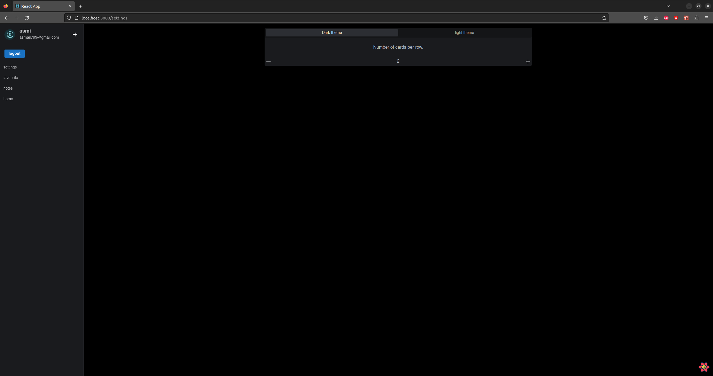
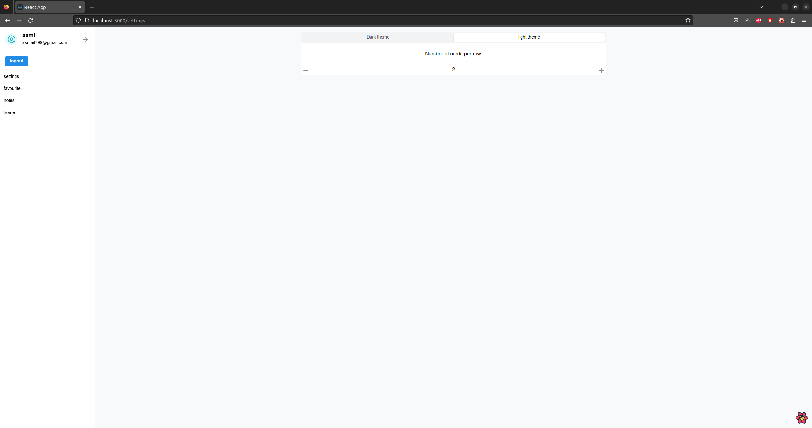
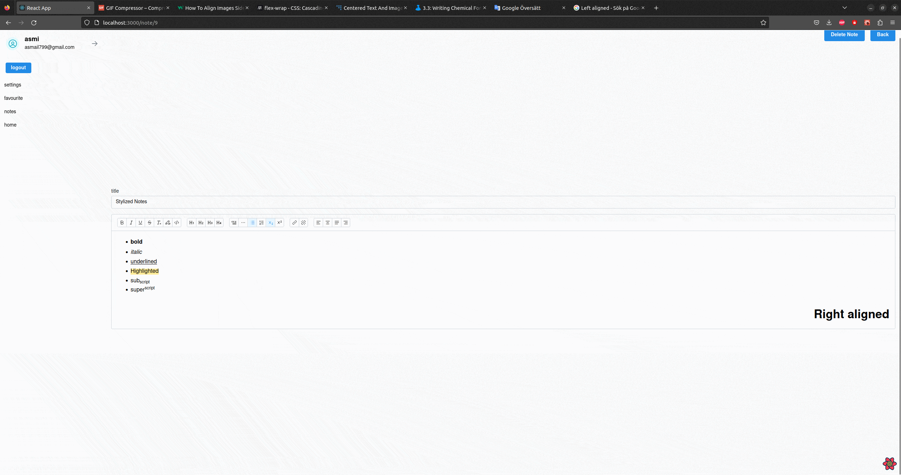
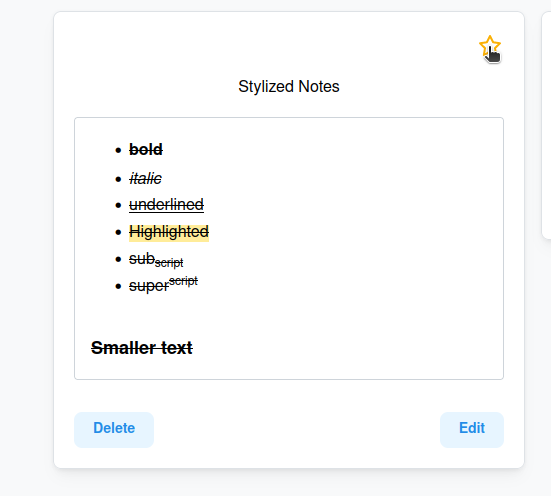
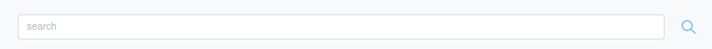
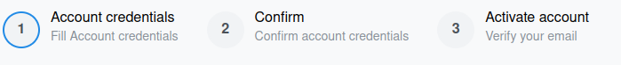
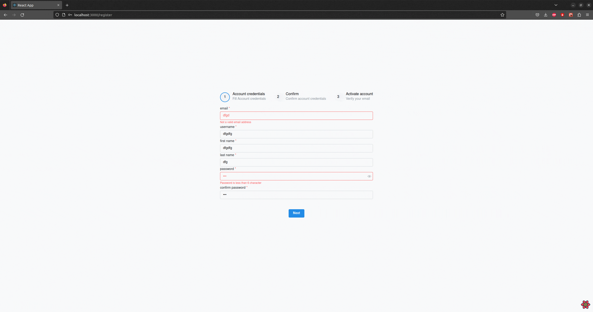

#  Dark And light Theme 

The editor comes with a dark and light theme.

 

# Stylized notes 

Simple stylisation such bold, italic, subscript and superscript is possible.

 

#  Other funcincality 

##  Important notes can be star marked for easier finding
<!-- TODO gif showing favourite seciton  and star button-->

 

  
##  You can search after a note based on its title or content 
<!-- TODO gif search example -->

 

## Notes are saved automatically 

No need to save note manually. As soon a change occur the note is automatically updated.

## Clear registiontion process 

The registiontion process is divided in 3 simple steps: fill account credentials, confirm credentials and verify email.</h3>

 

 

